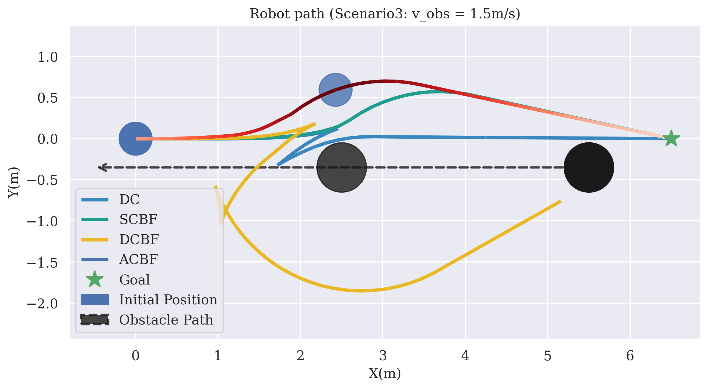

# Demo-CBF2311
Model Predictive Control with discrete-time Control Barrier Functions (MPC-CBF) for a wheeled mobile robot.

The MPC-CBF optimization problem is given by:

$$
\begin{aligned}
\min _{u_{t+N-1 \mid t}} & \frac{1}{2} \tilde{x}_N^T Q_x \tilde{x}_N+\sum_{k=0}^{N-1} \frac{1}{2} \tilde{x}_k^T Q_x \tilde{x}_k+\frac{1}{2} u_k^T Q_u u_k \\\text { s.t. } & x_{t+k+1 \mid t}=x_{t+k \mid t}+f\left(x_{t+k \mid t}, u_{t+k \mid t}\right) \cdot T_s, \quad k=0, \ldots, N-1, \\& x_{\min } \leq x_{t+k \mid t} \leq x_{\max }, \quad k=0, \ldots, N-1, \\& u_{\min } \leq u_{t+k \mid t} \leq u_{\max }, \quad k=0, \ldots, N-1, \\& x_{t \mid t}=x_t, \\& \Delta h\left(x_{t+k \mid t}, u_{t+k \mid t}\right) \geq-\gamma h\left(x_{t+k \mid t}\right), \quad k=0, \ldots, N-1
\end{aligned}
$$

可以将硬约束转变为软约束的形式，通常是引入松弛变量的方法的原理-原本的公式如以下:
$$
m(x,u,z,p_{\text{tv}}, p) \leq m_{\text{ub}}
$$

引入松弛变量$\epsilon$后，约束变为以下形式:
$$
\begin{aligned}
m(x,u,z,p_{\text{tv}}, p)-\epsilon \leq m_{\text{ub}} \\
0 \leq \epsilon \leq \epsilon_{\text{max}}
\end{aligned}
$$

松弛变量将添加到成本函数中，并与提供的惩罚项相乘。这种表述使约束变得软化，意味着可以容忍一定的违反，不会导致不可行性。通常建议对惩罚项使用较高的值，以避免对约束条件进行显著违反。

Quick Start
------------

To use this project, install it locally via:
```bash
git clone https://github.com/elena-ecn/mpc-cbf.git
```

The dependencies can be installed by running:
```bash
pip install -r requirements.txt
```

The controller configuration can be changed through the config.py.

To execute the code, run:
```bash
python3 main.py
```


Results
-------

### Example
Path comparison for different values of γ for MPC-CBF and with MPC-DC
<p align="center" width="100%">
    
    <br>Path comparison
</p>

### Scenario3
动态障碍物最大速度为1.5m/s的情况
<p align="center" width="100%">
    
    <br>Path comparison3: 最大循环周期15s，时间步长0.1s，MPC预测步数20，安全距离0.2m，机器人半径0.2m，gamma=0.3，机器人最大速度1.5，最大角速度0.8; scale = 0.5 * np.linalg.norm(obs_v)/1.5
</p>


References
----------
* [[1] J. Zeng, B. Zhang, K. Sreenath, Safety-critical model predictive control with discrete-time control barrier function, 2021 American Control Conference (ACC) (2020) 3882–3889.]()
* [[2] Z. Jian, Z. Yan, X. Lei, Z.-R. Lu, B. Lan, X. Wang, B. Liang, Dynamic control barrier function-based model predictive control to safety-critical obstacle-avoidance of mobile robot, 2023 IEEE International Conference on Robotics and Automation (ICRA) (2022) 3679–3685.]()

修改思路
---
1. 在`mpc_cbf.py`文件中，有静态障碍物，动态障碍物两个标志，影响`define_mpc()`中Add safety constraints的部分，一部分处理静态障碍物的情况，一部分处理动态障碍物的情况。
2. 需要在`config.py`文件中修改系统状态量为$[x,y,\theta] \to [x,y,\theta,\dot{x},\dot{y}]$，相应系统状态方程的系统矩阵，控制矩阵还有包括mpc的Q矩阵需要修改。
3. 在`mpc_cbf.py`文件的`def add_cbf_constraints()`函数进行修改，添加各种cbf约束的接口。
4. 在`mpc_cbf.py`文件的`def define_model()`函数添加一维参数tau，为acbf制定作准备：模型预测控制（MPC）的参数在每个控制周期中是*不会被外部直接修改的*，可以通过使用不确定性参数： 在模型中使用不确定性参数，1）model中设置变量-参数，mpc中设置不确定变量并且赋初值，simulator中设置`set_p_fun()`函数——可以通过`mpc.set_uncertainty_values()`方法在外部每个控制周期中动态地更新参数值。*注意只能传入一个一维数据，而不能是向量或矩阵，所以对于两个障碍物物需要分配2个不定参数*
5. mpc.data接口是数值模拟数据，通过`_x, _u, _z, _tvp, _p, _aux, _y`字段进行索引，还可以通过查看`mpc.data.data_fields`信息查看存在的各字段信息，已经从该接口获取机器人，障碍物的状态真值；外部不可以修改，所以后续数据处理还是得拿到保存的pkl数据。
6. do_mpc通过`save_results()`,`load_results()`函数可以实现仿真数据的保存和加载，用于后续`matplotlib`，`seaborn`的数据处理。
7. 目前MPC添加安全约束的方式是全局启用的，过于理想，实际上机器人对于障碍物的感知是存在范围限制的，因此是否添加安全约束因该根据情况实时判定——因此有必要引入一个不确定参数去修正这一情况；在调用`mpc.set_nl_cons()`函数时，可以用casadi.SX, MX表达式以修改安全约束表达式。-已完成
8. 在`def tvp_fun_mpc(t_now)`设置时变变量的函数中，可以针对性的对障碍物进行分段操作，这样有利于最后图形保存。
